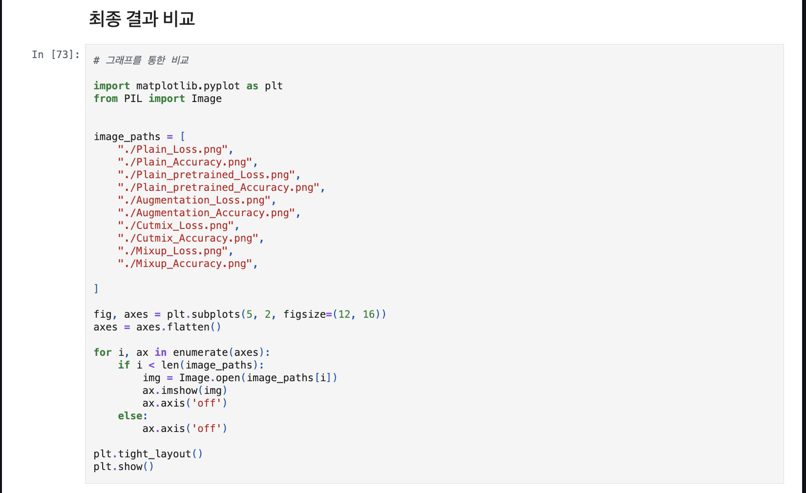
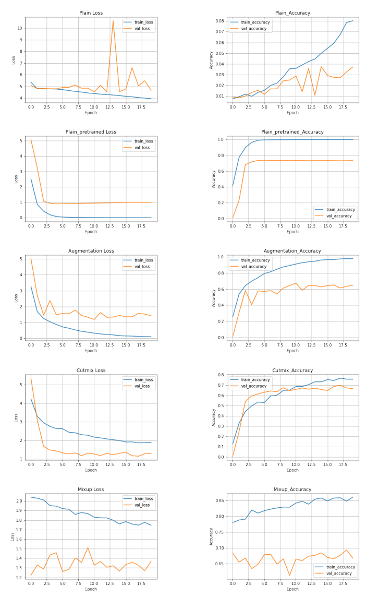
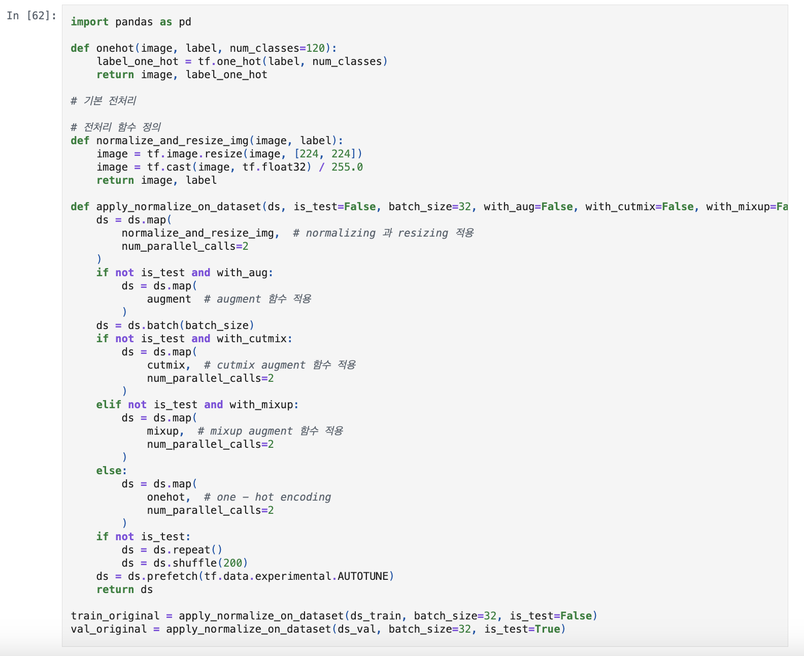
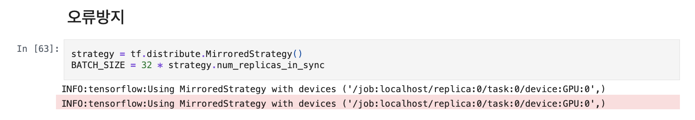
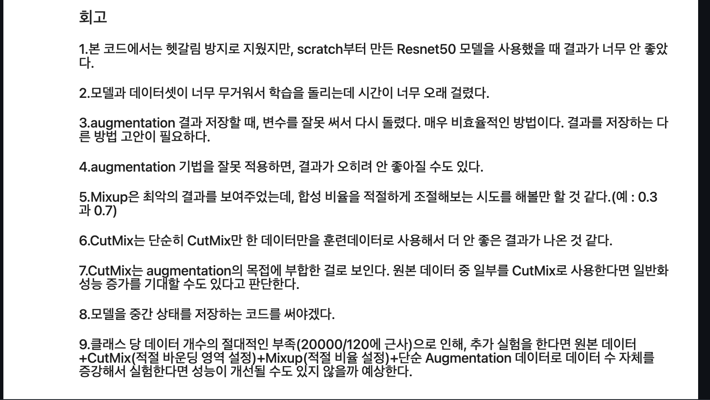
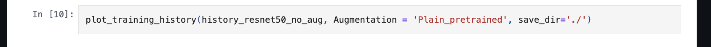

# AIFFEL Campus Online Code Peer Review Templete
- 코더 : 권재현.
- 리뷰어 : 신기성.


# PRT(Peer Review Template)
- [o]  **1. 주어진 문제를 해결하는 완성된 코드가 제출되었나요?**
    - 네 주어진 문제를 해결하는 완성된 코드가 잘 제출 되었습니다.
        - 중요! 해당 조건을 만족하는 부분을 캡쳐해 근거로 첨부

	 
	 


- [o]  **2. 전체 코드에서 가장 핵심적이거나 가장 복잡하고 이해하기 어려운 부분에 작성된 
주석 또는 doc string을 보고 해당 코드가 잘 이해되었나요?**
    -  제가 이코드가 핵심적이라고 생각한 이유는 병렬적 계산을 처리할때 좀 빠르게 연산하여 효율적으로 처리 할 수 있다는 장점이 있기 때문입니다.
    -  doc/string 과 annotation등이 달려있는점을 확인하였습니다.
    - 주석으로 설명을 간단하고 명료하게 적어놓았습니다.
    - 주석을 보고 코드의 이해도를 향상 시켜줄 수 있다 생각합니다. 
        - 중요! 잘 작성되었다고 생각되는 부분을 캡쳐해 근거로 첨부
        

	

- [o]  **3. 에러가 난 부분을 디버깅하여 문제를 해결한 기록을 남겼거나
새로운 시도 또는 추가 실험을 수행해봤나요?**
    - 문제 원인 및 해결 과정을 기록 하였다기 보다는 오류 방지를 미연에 시도하신것 같습니다.
    - 프로젝트 평가 기준에 더해 추가적으로 수행한 것들을 미리 보여주고, 그 부분을 다 고친 후 제출 하신것 같습니다.
        - 중요! 잘 작성되었다고 생각되는 부분을 캡쳐해 근거로 첨부

	
        
- [o]  **4. 회고를 잘 작성했나요?**
    - 네, 주어진 문제를 해결하는 완성된 코드 내지 프로젝트 결과물에 대해
    배운점과 아쉬운점, 느낀점 등이 기록되어 있는지 확인하였습니다.
  	 - 중요! 잘 작성되었다고 생각되는 부분을 캡쳐해 근거로 첨부
	
	
        
- [o]  **5. 코드가 간결하고 효율적인가요?**
    - 이 섹션에는 첨부를 하지 않았지만, 앞에서 보셨듯이 파이썬 스타일 가이드 (PEP8) 를 준수하였는지 확인하였습니다. 
    - 네,  코드 중복을 최소화하고 범용적으로 사용할 수 있도록 함수화/모듈화했는지 확인
        - 중요! 잘 작성되었다고 생각되는 부분을 캡쳐해 근거로 첨부


	
	
	
	

# 회고(참고 링크 및 코드 개선)
```
진짜 정리가 잘 되어 있다는 느낌을 받았고, 모델의 성능을 높이기 위해서 많은 시도와 노력등이 보였습니다.
현재는 저희가 사전에 pre-trained 된 모델을 가져와 쓰지만, 우리가 직접 pre-trained를 모델 자체에 직접 시켯을 때의 아이디어를 적용한게 인상 깊었던것 같습니다.
코드 리뷰 시 참고한 링크는 https://arxiv.org/abs/1512.03385. 
```
